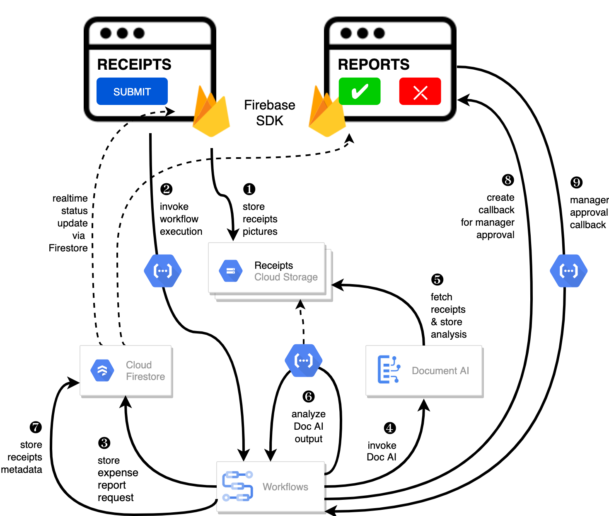
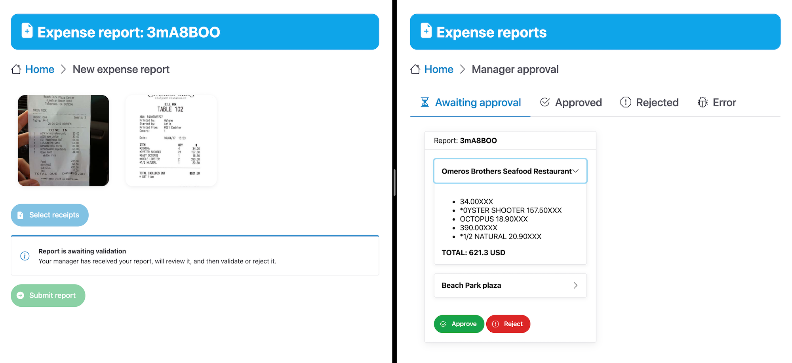

# Smart Expenses sample demonstration

Here is the architecture diagram of the application demonstrated 
in the Cloud Next 2021 [talk](https://cloud.withgoogle.com/next/catalog?session=DEV202#application-development)
**"AI-powered applications with Google Cloud"** (DEV202).

> Learn how you can harness the power of serverless computing with AI services like Document AI. 
> Build applications with speed, ease, and intelligence. See how AI-powered use cases, 
> combined with Workflows and Cloud Functions, can help automate use cases at your enterprise. 
> We’ll show you how to leverage pretrained models for form types like including receipts, 
> invoice processing, and more. Developers will be able to increase productivity 
> by spending less time worrying about infrastructure, and dedicate more time 
> building applications for their businesses.



This demo application is a smart expense report application, consisting of two main screens:

* a page for employees where they can select receipts and submit their expense reports,
* a page for manager to review, then approve or reject submitted expense reports.



The project makes use of the following [Google Cloud](https://cloud.google.com/storage) products:

* [Document AI](https://cloud.google.com/document-ai) to parse and analyse receipts to find meaningful information (supplier, line items, amounts, currency),
* [Workflows](https://cloud.google.com/workflows) to organize the overall business process, invoking Document AI and data analysis function, to update status in Firestore, to create a callback waiting for the manager's approval,
* [Cloud Functions](https://cloud.google.com/functions) to make the link between frontend and backend, and to extract data from Document AI's JSON output,
* [Firestore](https://cloud.google.com/firestore) to store all the data about the expense reports and receipts
* [Cloud Stroage](https://cloud.google.com/storage) to store pictures of receipts,
* [Firebase](https://firebase.google.com/) on the frontend to upload receipt pictures and to keep UI up-to-date with the realtime status of the expense report processing.

The project is using:

* [Vue.js](https://vuejs.org/) as its frontend progressive JavaScript framework,
* [Shoelace](https://shoelace.style/) as its library of web components,
* [Node.js](https://nodejs.org/en/) for the code of the few cloud functions.

# Some project setup notes

## Deploying the sample within your own project

Certain URLs pointing at cloud storage buckets or function locations are hard-coded.
To deploy the sample application in your own Google Cloud Project, you should update:

In `workflow.yaml`:
* The `bucket_input` and `bucket_output` variables to point at globally unique GCS buckets.
* In `invoke_document_ai` step, point at your location and at the right Document AI processor ID.
* In `process_annotations` step, point at the URL of your cloud function analysing Document AI's JSON output.

In `public/js/common.js`:
* Update the Firebase project configuration to point at your project (see Firebase [documentation](https://firebase.google.com/docs/web/learn-more#config-object))

In `public/js/admin.js`:
* Change the `callbackFunctionUrl` URL to point at the URL of your approval callback function.

In `public/js/request.js`:
* Change the `fnUrl` URL to point at the URL of your workflow invocation function.

## Deploying the workflow definition

```
gcloud workflows deploy batch-process-receipts \
    --location=europe-west4 \
    --source=workflow.yaml
```

## Web assets with Firebase

Login with Firebase (use `--no-localhost` flag if running in Cloud Shell):
```
firebase login
```

Deploy static assets to Firebase hosting
```
firebase deploy --only hosting
```

Run local server:
```
firebase serve
```

## Functions deployment

Environment variables
```
export FUNCTION_REGION=europe-west1
export WORKFLOW_REGION=europe-west4
export WORKFLOW_NAME=batch-process-receipts
```

Function invoking the workflow from the web frontend:
```
gcloud functions deploy invoke-workflow \
  --region=${FUNCTION_REGION} \
  --source=./services/invoke-workflow \
  --runtime nodejs14 \
  --entry-point=invokeWorkflow \
  --set-env-vars PROJECT_ID=${GOOGLE_CLOUD_PROJECT},WORKFLOW_REGION=${WORKFLOW_REGION},WORKFLOW_NAME=${WORKFLOW_NAME} \
  --trigger-http \
  --allow-unauthenticated
```

Function calling the workflow callback from the web frontend:
```
gcloud functions deploy approval-callback \
  --region=${FUNCTION_REGION} \
  --source=./services/approval-callback \
  --runtime nodejs14 \
  --entry-point=approvalCallbackCall \
  --trigger-http \
  --allow-unauthenticated
```

*Note:* The service account used by the function calling the callback URL should have the `Workflows Editor` (or `Workflows Admin`) and `Service Account Token Creator` permissions.

Function analysing the Doc AI output
```
gcloud functions deploy process-annotations \
  --region=${FUNCTION_REGION} \
  --source=./services/process-annotations \
  --runtime nodejs14 \
  --entry-point=processAnnotations \
  --trigger-http
```

## Firestore setup

To allow the web pages to access the data (in read-only mode) in Firestore, the security rules for Firestore should be updated with:

```
rules_version = '2';
service cloud.firestore {
  match /databases/{database}/documents {
    match /{document=**} {
      allow read, write: if false;
    }
  }
}
```

# License

All solutions within this repository are provided under the [Apache 2.0](https://www.apache.org/licenses/LICENSE-2.0) license. Please see the [LICENSE](https://github.com/GoogleCloudPlatform/smart-expenses/blob/main/LICENSE) file for more detailed terms and conditions.

# Disclaimer

This repository and its contents are not an official Google Product.